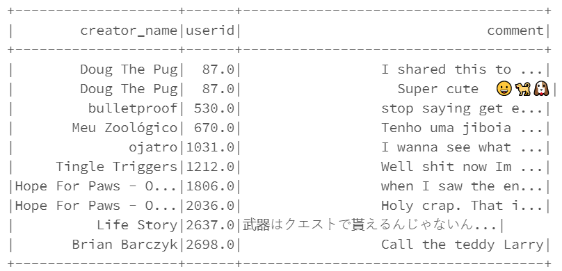
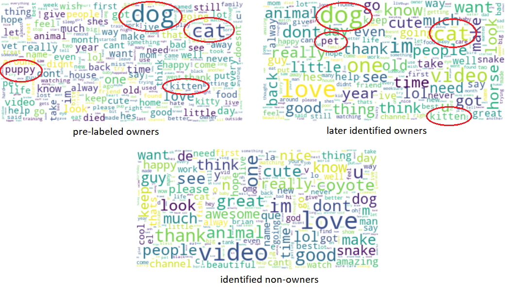
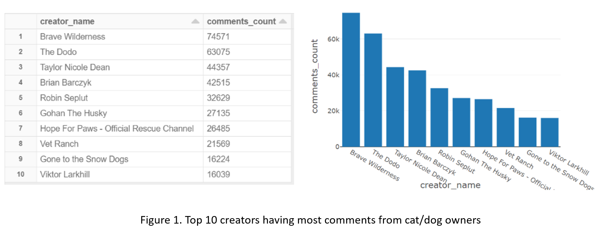
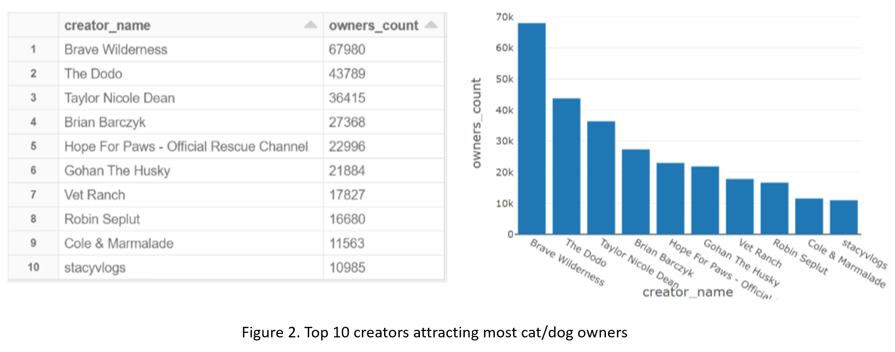
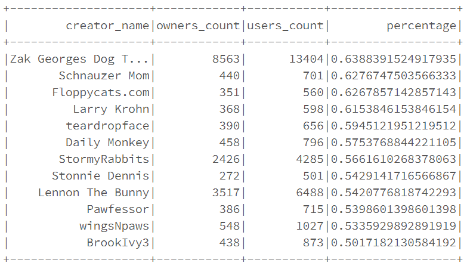

# Youtube Comments Analysis

**Note:** This project was completed at Azure Databricks. Dataframe may be displayed in a messed up format at Github. To view it at Databricks, please click here: [Youtube Comments Analysis](https://databricks-prod-cloudfront.cloud.databricks.com/public/4027ec902e239c93eaaa8714f173bcfc/5259370328395258/4223152150194536/1303224916364062/latest.html)

### Project Overview

This project used a 240MB compressed dataset which includes comments for videos related to animals and/or pets. A snapshot of the data is shown below. The task is to identify cat or dog owners from users that have left comments. The biggest challenge here is that I have to created labels so that the data can be fitted into classification algorithms. So, what I did first was creating labels according to some key words, then explored several models and measured their performance. The determined model was used to classify the whole dataset so that I was able to estimate the fraction of all users who are cat/dog owners. Finally, insights were extracted based on the classification results. 

### Exploratory Data Analysis

Before building models, I performed exploratory data analysis on the dataset. The insights are as follows:

- There are 5,820,035 rows of records in total. After removing empty comments, 5,818,984 rows were left. 
- The number of creators and users are 3,859 and 2,536,892, respectively. 
- As per creator, the maximum number of comments is 1,048,668, the minimum is 1 and the average is 1507.
- As per creator, the maximum number of users that have left comments is 635,800, the minimum is 1 and the average is 826.

### Data Preprocessing 

**Assign labels**: Initially, labels were created by searching several key words, including "my dog", "I have a dog", "my cat", "I have a cat", "my puppy", "my pup", "my kitty" and "my pussy". Every comment which includes any of these key words was labeled as "1" while others were labeled as "0".

**Feature construction**: Before being fitted into classification models, the comments were preprocessed using NLP technique. Features were constructed by tokenization and vectorization of comments text. 

**Balance data**: 40,225 out of 5,818,984  comments were labeled as "1", which results in a highly imbalanced dataset. To avoid classification bias, a large fraction of comments with label "0" was discarded. Then both classes were split with a ratio of 4:1 to construct training and testing subsets. The training set contained 64, 398 cases and the testing set contained 16,052 cases. Both sets had ratio between class 0 and class 1 as 1:1, roughly.

### Modeling

**Algorithms**: Three algorithms were chosen for this project, including logistic regression, random forest and gradient boosted trees. Grid search and cross validation were used to optimize hyperparameters. The metric to measure model performance was the area under ROC. 

**Model evaluation**: Best models from three algorithms were tested on the test dataset. The largest area under ROC was achieved by the random forest model. Results are shown in the below table.

**Application**: When I used these three models to estimate the fraction of cat/dog owners, results from random forest and gradient boosted trees were very similar, as shown below. The choice between random forest and gradient boosted trees was depending on application scenarios. I assumed that the cat/dog owners identification would be used to distribute promotions or advertisements. In that scenario, a little fraction of misidentified cat/dog owners was fine. Therefore, the **gradient boosted trees model** was chosen for following analysis. 

|               | Logistic Regression | Random Forest | Gradient Boosted Trees |
| :-----------: | :-----------------: | :-----------: | :--------------------: |
| are under ROC |        0.958        |     0.963     |         0.958          |
|  estimation   |       12.071%       |    13.686%    |        13.934%         |

### Insights and Discussions

**Prediction vs label**: From the very beginning, 40,225 comments were labeled as "1". Let's call them **pre-labeled owners**. And our model identified 36,840 of them, which corresponds to 91.58%. What deserves more attention is that the model identified many other users, who left 774,005 comments, as cat/dog owners. Let's call them **later identified owners**. This "misidentification" comes from the similarity between comments from pre-labeled owners and these later identified owners. 

**Topics among users**: Stop words were removed from comments and word clouds were plotted for three group of users: pre-labeled owners, later identified owners and predicted non-owners. We can see from the below plots that topics among later identified owners are similar to those among pre-labeled owners, while non owners are talking about something different. 

**Popular creators**: Let's say we would like to find out popular video creators among cat/dog owners so that we may embed advertisements into their videos to promote our business. "Popular" can be defined from different aspects. Below are examples of what we can get from the estimation of our model. Figure 1 shows the top ten creators who got most comments from cat/dog owners. Figure 2 shows the top ten creators who have attracted most cat/dog owners. 

Also, I tried to find out creators who have attracted more than 500 users and more than half of the users are cat/dog owners. These video creators could be beginners, however, have high potential to attract more cat/dog owners. There are 12 such creators as listed below. 

**Future work**: The word clouds are basically visualizations of word counts. To improve analysis of topics, clustering algorithms like KMeans or LDA could be considered. But this will require much more computing power. 

